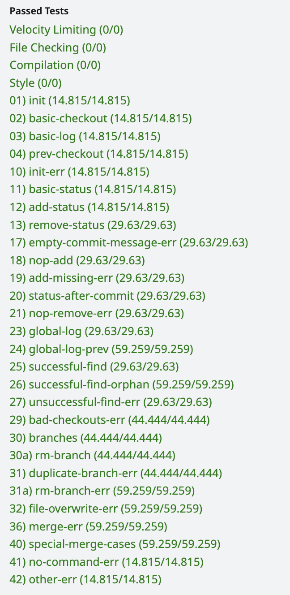
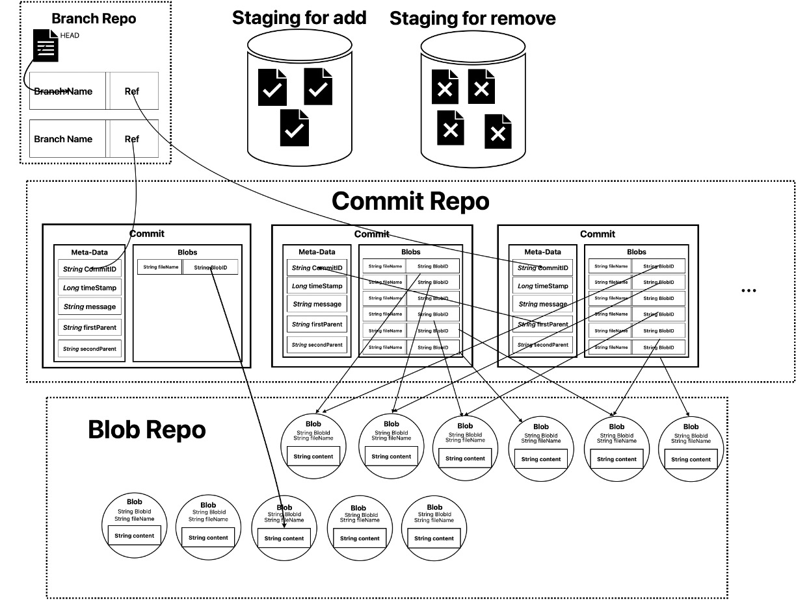

# Git-Bone

```txt
 ▗▄▄▖▄    ■  ▗▄▄▖  ▄▄▄  ▄▄▄▄  ▗▞▀▚▖
▐▌   ▄ ▗▄▟▙▄▖▐▌ ▐▌█   █ █   █ ▐▛▀▀▘
▐▌▝▜▌█   ▐▌  ▐▛▀▚▖▀▄▄▄▀ █   █ ▝▚▄▄▖
▝▚▄▞▘█   ▐▌  ▐▙▄▞▘                 
         ▐▌                        
```

Git-bone is a proven-to-be-practical, baby-git VCS(Version Control System) skeleton code built simply on Java. It is a *encrypted*, but nonetheless less painful skeleton code for learners to implement their own `git`.  It is originated from the author's implementation (which is me!) for a git project, all the main codes excluded, only helpful comments left for programming novice and lovers to implement their own git.

## Git-Bone is, in fact,  [Gitlet](https://sp21.datastructur.es/materials/proj/proj2/proj2)

Git-Bone is essentially one possible [gitlet](https://sp21.datastructur.es/materials/proj/proj2/proj2) implementation design. The [gitlet](https://sp21.datastructur.es/materials/proj/proj2/proj2) is the most popular lab project for the course [CS61B](https://sp21.datastructur.es/). The project is designed to help anyone who want to 

1. Understand [git](https://git-scm.com/) better.

2. Refining their programming skills. In terms of

   A. Being more comfortable when reading vast amounts of documentation.

   B. Being more thoughtful when choosing an appropriate data structure based on business demands.

   C. Being more careful when implementing any core features via a bunch of code.

However, dealing with designing classes and methods may be intimidating. `Git-Bone` can help those who want to achieve the above two goals with finishing the [gitlet](https://sp21.datastructur.es/materials/proj/proj2/proj2) with less painful experience.

----

**BUT IT IS STRONGLY SUGGESTED YOU TRY TO FINISH IT <u>PURELY</u> ON [THE OFFICIAL PROJECT DOCUMENTATION ON GITLET](https://sp21.datastructur.es/materials/proj/proj2/proj2))!**

----

## Developing Environment

This is just my dev environment for implementing git-bone. Earlier version would work as well!

### Java Version

```shell
~ % java -version
java version "22.0.2" 2024-07-16
Java(TM) SE Runtime Environment (build 22.0.2+9-70)
Java HotSpot(TM) 64-Bit Server VM (build 22.0.2+9-70, mixed mode, sharing)
```

### Gitlet Version

The gitlet version is the [CS61B-sp21](https://sp21.datastructur.es/). 

### Grader

The grader for testing your code is on gradescope. Detailed info is in [CS61B-sp21-acknowledgement](https://sp21.datastructur.es/about.html#acknowledgements). For convenience I just copied it:

> #### Auditing
>
> ...
>
> <u>**We also have an autograder on Gradescope set up just for you! The Gradescope course activation code is P5WVGW**</u>. We’ll release the autograder for assignments about 3 days after it is due for Berkeley students.

That's it! Register an account on Gradescope. Use the activation code and go for **gitlet** after you think you finish.

## How to use this repo

**This is just one recommended workflow for using this repo to speed up your personal gitlet implementation. It is still strongly suggested you go completely with gitlet requirements.** 

Step 1: Read [the original documentation for gitlet](https://sp21.datastructur.es/materials/proj/proj2/proj2). Understand how it works and try to think how to implement gitlet on your own first!

Step 2: If you believe you cannot finish all features (for lacking coding skills or just out of your time budget), clone `git-bone` to your machine and go to the working directory:

```shell
git clone https://github.com/WhuanY/Git-Bone.git
cd git-bone
```

Step 3: Test if it can compile by running:

```shell
make 
```

If successful, it should compile with a message like this:
```shell
"/Library/Developer/CommandLineTools/usr/bin/make" -C gitlet default
javac -g -Xlint:unchecked -Xlint:deprecation -cp "../../library-sp21/javalib/:..::;../../library-sp21/javalib/;..;" Blob.java Branch.java Commit.java DumpObj.java Dumpable.java GitletException.java Helper.java Main.java Repository.java Utils.java
touch sentinel
```

Step 4: See Java files in the following sequence to get a basic understanding of the git-bone structure:

``````
Main.java -> 
Repository.java -> 
Commit.java, Blob.java, Branch.java -> 
Utils.java, Helper.java
``````

Step 5: Filling git-bone at your own pace! Remember to read, read and read gitlet docs!

Step 6: As you proceed. There are some helpful tests that enable you to test your currently employed features. [See the testing part in gitlet](https://sp21.datastructur.es/materials/proj/proj2/proj2#testing) for more details.

My own implementation has been tested on all my self-written integration test files.

```shell
cd testing
make check
```

If you passed all the written tests. Your output would be like: 

```
Testing application gitlet.Main...
CLASSPATH="$(pwd)/..::;$(pwd)/..;" python3 tester.py  samples/*.in student_tests/*.in *.in
test01-init:
OK
test02-basic-checkout:
OK
...
test12-MergeAllCases:
OK

Ran 19 tests. All passed.
```

Step 7: Push your code on gradescope. Noted that passing all the 19 local tests doesn't mean getting a full score on the gradescope! My solution is just about 80%. But it is totally enough for learning and fun purpose.



Some merges test cases in gradeScope looks weird to me. Should anyone get a higher score than me, you are totally welcome to submit a pull request.

## Git-bone in One Figure

This pic is drawn for fun. Also, I hope it helps anyone who wants to gain a quicker understanding of Git-Bone.



## Notes at last

1. If you are intersted in the project. First try on your own with only necessary but not additional help.
2. This is just ONE POSSIBLE implementation! Git-Bone is set and shared for inspiration. There are some already-known optimazation techniques for currently implemented solution. Feel free to jump out of framework made by `Git-Bone`.

## Acknowledgment

Thanks all the staff at CS61B making and continuing fine-tuning such wonderful project. 
